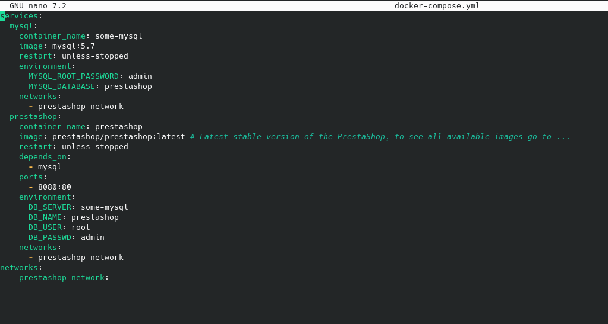
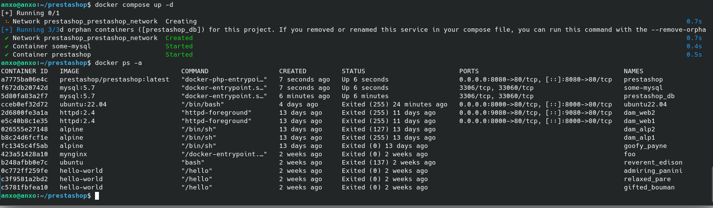
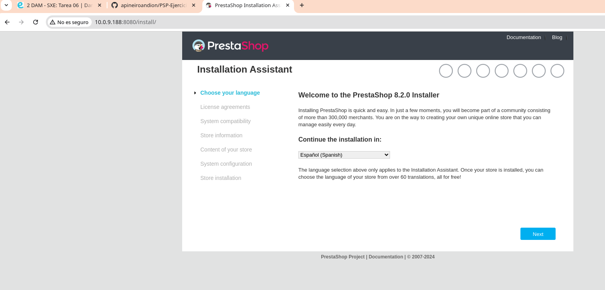
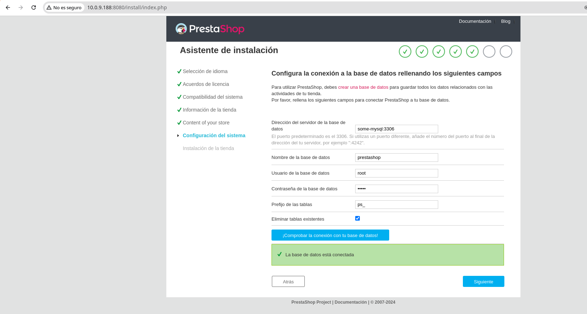
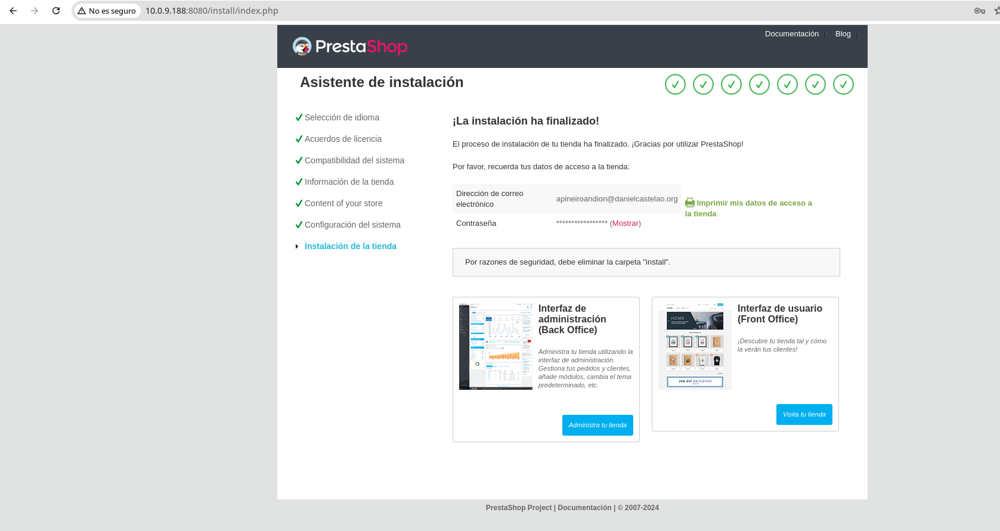
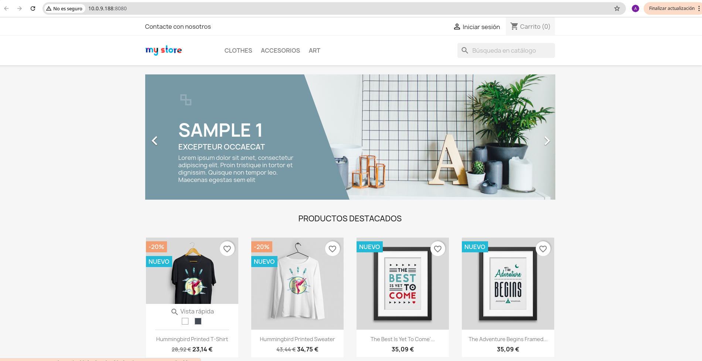

# Utiliza docker para poner en marcha Prestashop.

### Crear un repositorio en github y enlazarlo aquí.

### Describe el proceso en un documento Readme. Utiliza capturas para demostrar el funcionamiento en el navegador.

### Se valorará:

### 1. El uso de docker-compose.
### 2. Claridad en la explicación

### Ejercicio:

### 1. Crea un archivo docker-compose.yml con la configuración necesaria para poner en marcha Prestashop.

Para hacerlo de manera mas organizada primero creo una carpeta llamada prestashop y me situo en ella:

```mkdir prestashop```

```cd prestashop```

Creamos el archivo docker-compose.yml:

```touch docker-compose.yml```

Accedemos a el con nano:

```nano docker-compose.yml```

Y añadimos el siguiente contenido:

```
services:
  mysql:
    container_name: some-mysql
    image: mysql:5.7
    restart: unless-stopped
    environment:
      MYSQL_ROOT_PASSWORD: admin
      MYSQL_DATABASE: prestashop
    networks:
      - prestashop_network
  prestashop:
    container_name: prestashop
    image: prestashop/prestashop:latest # Latest stable version of the PrestaShop, to see all available images go to ...
    restart: unless-stopped
    depends_on:
      - mysql
    ports:
      - 8080:80
    environment:
      DB_SERVER: some-mysql
      DB_NAME: prestashop
      DB_USER: root
      DB_PASSWD: admin
    networks:
      - prestashop_network
networks:
    prestashop_network:
```



### 2. Ponemos a funcionar el contenedor con el siguiente comando:

```docker-compose up -d```



Podemos comprobar que esta todo correcto con:

```docker ps -a```

### 3. Accedemos a la dirección http://10.0.9.188:8080/ y comprobamos que la instalación de Prestashop se ha realizado correctamente.



Conectamos la base de datos 





